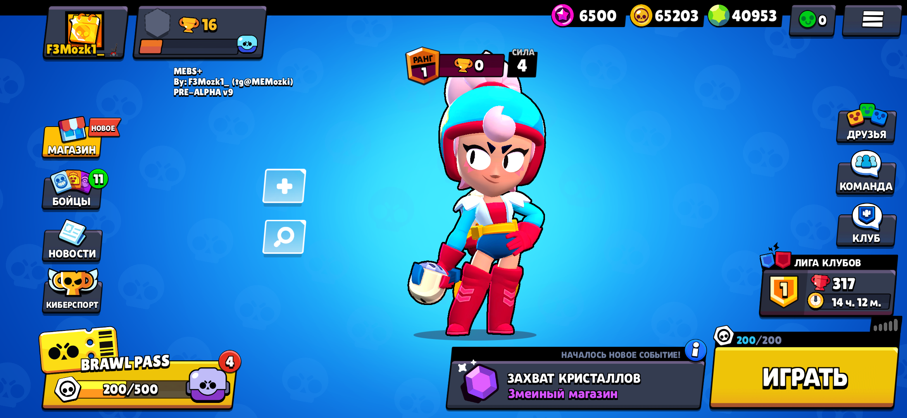

# MEBS+ 43.231.1

Server Brawl Stars for v43.231.1 in Python from F3Mozk1_d3v (Me)

 

### Requirements:
- Python 3.8 or higher
- sqlite3
- colorama

### Configuration
First, go to `Configuration.py` and set the ip to `0.0.0.0` and the port to `9339`. For local use of the server. 

### Running the server
In a terminal, type __`python lib.py`__ then __`python Core.py`__

### Not works:
- Rooms
- Brawl Pass
- Trophy League
- The end of the fight (almost)
- Some Brawlers

### Configuring the client app
To connect to your server, a **patched client** is required. 
Download this [base APK](https://mega.nz/file/RCcQgLhC#pAYethGveBwGtWzYio6pyux-KQq2QInQg-SYn_ZRhpw) and change the IP in `libprojectbsds.config.so`, if you want to use BSDS locally on your device, you can use "127.0.0.1" as the IP. If not, then you can use your device's IPv4 address. 

#### The APK was recently updated to support Android 12+ and Emulators.

### Need help?
Contact me via  
[Telegram](https://t.me/MEMozki)

### IMPORTANT
This content is not affiliated, approved, sponsored or approved specifically by Supercell and Supercell is not responsible for it. For more, see the Supercell Fan Content Policy: www.supercell.com/fan-content-policy
